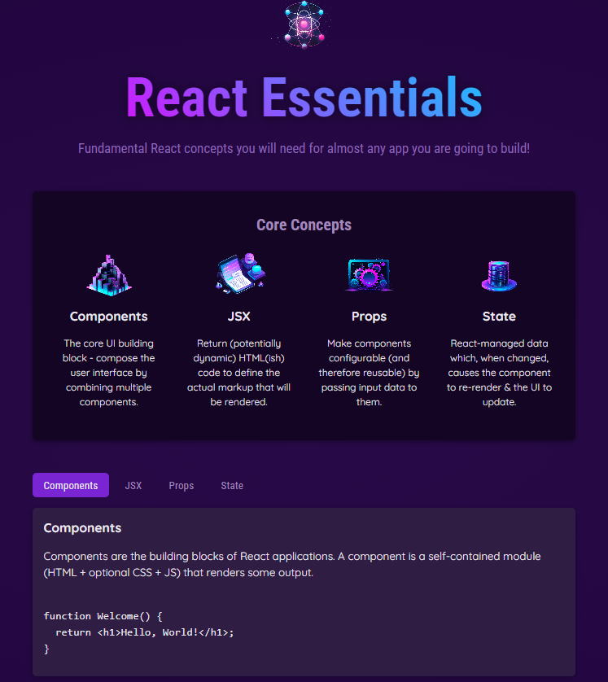

# React Essentials - Daniela Serrano

This is a React project using where it is explained some basic concepts.

## Table of contents

- [Overview](#overview)
  - [The exercise](#the-exercise)
  - [Screenshot](#screenshot)
  - [Links](#links)
- [My process](#my-process)
  - [Built with](#built-with)
- [Author](#author)

## Overview

### The exercise

Users should be able to:

- Read the information and understand the React basic concepts.

### Screenshot

### Links

- Live Site URL: [React Essentials](https://card-counter-score.netlify.app/)

## My process

### Built with

- React
- CSS custom properties
- JSX files

## Author

- Website - [Daniela Serrano](https://danielaser.github.io/)
- Github - [@danielaser](https://github.com/danielaser)
